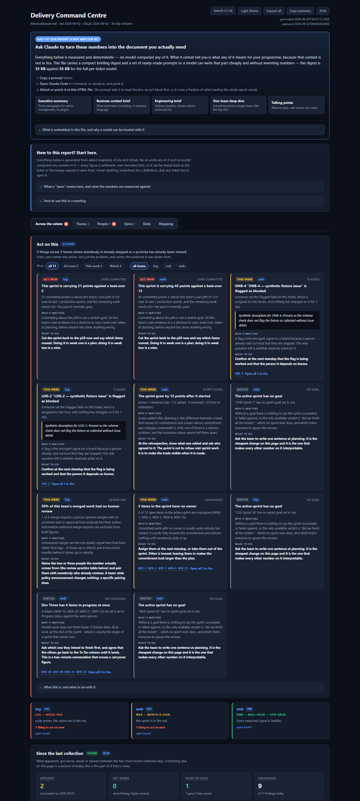

# Cadence

[](https://github.com/jakoreilly/Cadence/actions/workflows/ci.yml)
[](LICENSE)

A collector and data-quality reporter for sprint delivery across Jira boards and
GitLab groups. Built for a development manager who has to advise senior
management and wants to see problems while they are still cheap to fix.

Everything here is deterministic: no AI, no hosted service, no database. It
reads Jira and GitLab, writes dated JSON snapshots, and reports on them.

## The short version

Engineering-metrics tools are easy to build and easy to distrust: they show a
confident number, someone senior asks what is in it, and it falls apart. Cadence
is the opposite bet. It:

- **checks data hygiene before it reports velocity** - unestimated work, points
  split across two fields, work carried three-plus sprints - because the trend
  metrics are meaningless until you know what the board is missing;
- **labels every figure by how much it can be trusted** - `Sound` / `Weak` /
  `Unusable` - so the numbers that reach senior management are the ones that
  survive being questioned, and the ones that cannot yet are marked, not hidden;
- **excludes the robots from the denominator** - counting the automated reviewer
  and bot-authored merge requests turns a real 12% "merged with no human review"
  into a meaningless 54%;
- **keys every metric on `statusCategory`, never status names** - one real board
  had four distinct "Done" statuses and a "Product Owner Review" that Jira
  classes as *To Do*;
- **ships one self-contained HTML command centre** - no server, no build step, no
  CDN, no runtime network. It opens from `file://` on a locked-down laptop and
  survives a projector.

Roughly 20k lines of dependency-light TypeScript (only Chart.js is vendored),
built for one team and generalized. The reasoning behind each choice is written
down in [docs/decisions.md](docs/decisions.md) so it is not silently
re-litigated.

## See it without a Jira account

The repo ships a synthetic three-board fixture, so the full report renders with
no credentials and no collected history:

```
npm install && npm run build
node scripts/build-fixture.mjs
node dist/src/cli.js report --profile profiles/fixture --out sample.html
```

A pre-generated copy is committed at
[`examples/sample-report.html`](examples/sample-report.html) (open it raw), and
here is the top of it:



## Why snapshots

Jira answers "what does the board look like now" well and "what did it look like
on day 4 of the sprint" badly. Scope churn, carryover drift and burndown shape
all need the second question.

So `collect` writes an **immutable dated snapshot** and never mutates an older
one. Every trend metric then falls out of diffing consecutive snapshots, with no
vendor analytics and no AI. **This history cannot be backfilled** - the value of
the tool grows from the day collection starts, which is why the collector shipped
before any UI.

## Quick start

```
npm install && npm run build

# 1. Resolve this site's custom field ids once (cached in the profile).
node dist/src/cli.js discover-fields --profile profiles/acme

# 2. Find the board ids your teams actually use.
node dist/src/cli.js discover-boards --profile profiles/acme --project WEB

# 3. Collect. Run this daily.
node dist/src/cli.js collect --profile profiles/acme

# 4. Read the data-quality report for the newest snapshot.
node dist/src/cli.js quality --profile profiles/acme

# 5. Per-sprint delivery metrics and the empirical forecast.
node dist/src/cli.js trends --profile profiles/acme

# 6. Find the GitLab groups your teams actually use.
node dist/src/cli.js discover-groups --profile profiles/acme

# 6b. ...and work out WHICH group belongs to WHICH board, from evidence.
#     Scores every visible group against every configured board on two axes and
#     shows its working. Writes nothing - you read the evidence and decide.
node dist/src/cli.js suggest-groups --profile profiles/acme

# 7. Merge-request review latency - the only leading indicator here.
node dist/src/cli.js review --profile profiles/acme

# 8. Snapshot-to-snapshot metrics: observed scope churn, real burndown, true
#    cycle time, and how long work has sat in each board column. Needs two
#    collected days; says so plainly until it has them.
node dist/src/cli.js history --profile profiles/acme

# 9. The command centre - one self-contained HTML file over all of the above.
node dist/src/cli.js report --profile profiles/acme
# ...or narrowed to one board, to hand somebody just the part that concerns them:
node dist/src/cli.js report --profile profiles/acme --team fs
# ...or timestamped into reports/, so runs never overwrite each other:
scripts\generate-report.cmd acme

# 10. Push, rather than pull: send the findings that are NEW or have got WORSE
#     to Slack and/or a Confluence log. Prints what it would send when no
#     destination is configured, and --dry-run never writes state.
node dist/src/cli.js alert --profile profiles/acme --dry-run
```

Collection is scheduled daily via Windows Task Scheduler - see
[docs/scheduling.md](docs/scheduling.md). It costs **no tokens**: no model is
involved in collection, derivation or reporting.

Credentials come from `secrets.local.json` inside the profile directory
(gitignored via `*.local.json`), or from `ATLASSIAN_BASE_URL`,
`ATLASSIAN_EMAIL`, `ATLASSIAN_API_TOKEN`, `GITLAB_BASE_URL`, `GITLAB_TOKEN`,
`GITHUB_TOKEN`, `GITHUB_BASE_URL`, `SLACK_TOKEN`.
Env vars win, so a scheduled run needs no file on disk. The Atlassian token needs
read access only; the GitLab token needs `read_api`; the GitHub token needs
`pull requests: read` (fine-grained) or classic `repo` read.

## GitLab or GitHub

The merge/pull-request half of a collection reads **GitLab by default**. Set
`"forge": "github"` in a profile's `config.json` and give each team
`"githubRepos": ["owner/repo", ...]` instead of `gitlabGroups`, and `collect`
reads GitHub pull requests instead - see `profiles/acme-github` for a worked
example.

Everything downstream is forge-agnostic: both collectors write the same
`MergeRequestSnapshot` shape into the same `gitlab.json` slot (its `source`
field records which host), so `review`, `history`, the report and `alert` are
identical either way. GitHub bot detection is better out of the box
(`type: "Bot"` and the `[bot]` login suffix are handled automatically;
`reviewBotAccounts` is only for service accounts created as ordinary users).
`discover-groups` and `suggest-groups` are GitLab-only - GitHub repos are flat
`owner/repo`, so you list them by hand.

## Layout

```
profiles/<name>/config.json        teams, committed, no secrets
profiles/<name>/field-map.json     discovered custom field ids, committed
profiles/<name>/secrets.local.json credentials, gitignored
data/<profile>/<YYYY-MM-DD>/jira.json
data/<profile>/<YYYY-MM-DD>/gitlab.json
data/<profile>/<YYYY-MM-DD>/context.json   Confluence, when configured
data/<profile>/changelog/<boardId>.json  append-only Jira change history
data/<profile>/alert-state.json    what has already been alerted on
```

A team **is** a Jira Agile board. Sprints belong to boards, so burndown,
velocity and carryover all compute without any extra mapping layer.
`gitlabGroups` (or `githubRepos`, when `forge` is `github`) attaches that team's
repositories.

**But only an *origin* board is a team.** This site has 48 boards, and several
are views over another board's sprints rather than teams of their own - board
703 shares 100% of its sprints with board 702. Configuring both would double
every shared metric while looking perfectly plausible. The test is
`originBoardId` on the sprint object; see [docs/decisions.md](docs/decisions.md).

In a running install `data/` is deliberately **not** gitignored - the snapshot
history is the asset, and it cannot be backfilled. This public template ships
with `data/` gitignored instead (there is no history to carry, and a real one
would contain per-person delivery data); drop the `data/` line from
`.gitignore` once you start collecting for real.

## What the quality report checks

It runs first because velocity and burndown are meaningless until the underlying
hygiene is known. Verified live against board 701 (`WEB Scrum`, 860 issues,
64 sprints):

| Finding | Why it matters |
|---|---|
| `unestimated-in-sprint` | no forecast possible for those items |
| `story-points-split-across-fields` | the classic "velocity halved" artefact |
| `carried-three-plus-sprints` | badly defined work, not badly worked |
| `stale-in-progress` | claimed but not moving; the best early blockage signal |
| `unassigned-in-sprint` | committed but not started |
| `flagged-blocked` | explicit impediments |
| `created-after-sprint-start` | approximate scope churn (exact needs 2 snapshots) |
| `multiple-active-sprints` | two teams sharing a board breaks every metric |
| `sprint-goal-missing` | nothing to measure delivery against |
| `no-board-columns` | no status-to-column mapping for cycle-time boundaries |

`--json` emits the same results as structured data for a UI to consume.

## Why status names are never used for logic

From the first live collection of board 701. Four distinct Done statuses, and a
status called "Product Owner Review" that Jira categorises as To Do:

```
  497  Done         Resolved
  102  In Progress  Waiting Test
   90  Done         Closed
   64  To Do        Product Owner Review
   25  In Progress  Development Complete
   23  Done         Close
   15  Done         Done
```

Every metric therefore keys on `statusCategory`, with `status` and the board's
own column configuration kept alongside for per-team cycle-time boundaries.

## Trends and forecasting

`trends` derives per-sprint delivery metrics and an empirical forecast from the
team's own history. Board 701 already carries **63 closed sprints**, so this
works from the first snapshot rather than after weeks of collecting.

The forecast is a p10/p50/p90 band over completed output in the last N closed
sprints (default 12, about six months at a two-week cadence). No targets, no
model - just what the team has actually done.

Output is labelled by trustworthiness, because the metrics are not equally
sound when reconstructed from a single snapshot:

| | Metric | Why |
|---|---|---|
| **Sound** | completed issues, completed points, the forecast | anchored to `resolutionDate` inside the sprint window, independent of current board state |
| **Weak** | lead time p50/p90 | `created -> resolved`, so it includes backlog dwell. Real cycle time needs work-start, which consecutive snapshots supply |
| **Unusable** | committed, carryover, for *closed* sprints | counts every issue in that sprint *now*, so an issue that passed through 16 sprints counts as committed in all 16. Accurate for the *active* sprint only |

That distinction is the point: the numbers that go to senior management have to
survive being questioned, so the ones that cannot yet be trusted say so.

## Review metrics

`review` is the only **leading** indicator the tool produces. Everything derived
from Jira describes a sprint that already happened; a merge request sitting
unreviewed today is a problem this week.

It is also the only report whose figures are *not* reconstructed. A comment
timestamp and a merge timestamp were recorded when they happened, and no later
activity restates them - so unlike the sprint metrics, these are sound from a
single snapshot.

Two things make the numbers defensible, and both were found the hard way against
the real instance:

**The automated reviewer is not a reviewer.** A service account comments on and
approves nearly every merge request, within about half an hour. Counting it gives
an excellent review latency for code no person read. `reviewBotAccounts` in the
profile config lists those accounts - it has to be configuration, because
GitLab's own `bot` flag is not set on them.

List **both the username and the display name** of every service account. They
are not always the same, and the difference is not cosmetic: the automation
account here is username `bot`, display name `I'm a Bot`. The profile listed
only the display name - which is what the GitLab UI shows - so a username-only
match classified it as a *person*. It had authored 22 merge requests in one
group, inflating that team's unreviewed rate and putting a robot in the
per-person review-practice table. Matching now covers either field.

**Bot-authored merge requests are not in the denominator.** Including them, 54%
of merged work had no human review. Excluding them - dependency bumps and
mechanical fixes nobody meant to read - it is 12%. Same data; only the second
describes the team. The automation count is reported alongside, never hidden.

Unknown is not zero: a merge request whose review detail could not be read counts
as unknown rather than as unreviewed, because that would inflate the headline.

Merge requests are scoped to **GitLab groups**, not to a Jira board, and how well
the two can be joined depends on branch-naming discipline in that group - 13 of
55 in one group here, 0 of 230 in another. `review --json` reports the coverage
rather than assuming it. See [docs/decisions.md](docs/decisions.md).

Which groups belong to a team is something the tool **derives and evidences**,
not something you have to know up front - that is one of the questions it exists
to answer.

## Per-person attribution

`individualAttribution` in the profile config controls whether assignee,
reporter, creator and GitLab author/reviewer identities are written. It is
enforced at **write** time, not display time: with it off, no person-shaped data
reaches the snapshot at all, so it cannot leak later.

Currently **on** for `profiles/acme`, by explicit decision. See
[docs/decisions.md](docs/decisions.md).

## The command centre

`report` writes a **single self-contained HTML file** - no server, no build
step, no CDN, no runtime network of any kind. Chart.js is vendored: read out of
`node_modules` at generation time and inlined. Copy the one file anywhere and it
still works, which is the point - it has to open from `file://` on a locked-down
laptop and survive a projector.

`scripts/generate-report.cmd [profile]` writes a timestamped copy into
`reports/` so successive runs never overwrite each other.

**A team panel opens only what needs the reader today.** Every section is there;
the ones that do not need you are closed to a single line that still carries the
heading, the trustworthiness tag and the section's own reading, so a closed
section is *summarised*, not hidden - which matters in a document whose reader's
job is to distrust it. A section opens when its reading is poor or worth
watching, when it carries something at the act-now level, or when it changed
since the last collection; `act`, `sprint` and `board` open regardless, so a
healthy board never renders as two dozen blank rows. **Expand all** opens
everything, printing forces everything open, and the tables that sit under a
chart and restate its figures are behind their own one-line disclosure. An
"only what needs me" filter hides the rest without touching any section's own
state, and clears itself before printing - a silently partial printout is not
detectable from paper.

What it shows, in the order a manager reads it:

| | |
|---|---|
| **Triage banner** | one card per team, sorted worst first: *needs you* / *worth a look* / *well oiled — step back*, each naming the signals that are red |
| **Portfolio** | every team compared in one sortable table and one chart — p50, p90, what they are carrying now, whether this sprint will land |
| **Per-team tabs** | KPI tiles, a five-signal health scorecard, delivery over time, will-this-sprint-land, work that needs you, review practice, longest lead times |
| **Work that needs you** | ticket-level: blocked, carried 3+ sprints, stale, unestimated, unassigned — click any row for detail and what it usually means |
| **Review practice** | who merges their own work with nobody looking, and who reviews other people's |
| **Scope churn & burndown** | what changed about this sprint between collections — observed, not reconstructed |
| **Cycle time** | how long work takes once someone starts it, with backlog dwell reported separately |
| **How long work sits in each column** | the queue that is actually holding delivery up, walked from the column each ticket was recorded in on every collected day &mdash; not from its last-updated timestamp, which resets when somebody merely comments. A column whose entries were mostly already there when collection began reports its exact count and **withholds** its median rather than quoting one drawn from a single observation |
| **Backlog** | what is queued behind the active sprint, in the order the team ranked it |

It is also usable by a keyboard and by a reader who is not looking at a
projector: tabs are arrow-key navigable and deep-linkable (`report.html#team=fs`
opens that board), the ticket table has a filter box, the ticket modal traps
focus and returns it, there is a light/dark toggle that is remembered per
reader, and printing flips the whole palette rather than only the body — a dark
page otherwise prints as black rectangles with invisible text.

### The rules it holds to

A chart makes everything look equally solid, so:

- **Chart.js may draw, never compute.** Every number it plots is also written
  out as text in the HTML, so a blocked inline script degrades the page to
  readable tables rather than to blank panels — and no client-side path can
  reach a different number from the CLI.
- **Every section carries its own SOUND / WEAK / UNUSABLE / CAVEAT label** next
  to the numbers, not once in a legend at the bottom.
- **The time-series charts plot completed points only.** Charting `committed`
  per closed sprint would put the UNUSABLE metric on a projector. The active
  sprint's committed load *is* drawn, in its own colour and labelled
  committed-not-delivered, because for the active sprint alone it is accurate.
- **A reassuring verdict is withheld when its basis is missing** — a
  mostly-unestimated sprint reads "not comparable", never a green "within band",
  and gets no landing forecast at all. The *warning* side is still reported in
  the same state, because a partial count already over the p90 is a valid lower
  bound.
- **There is no points-per-person figure, and no single health score.** See
  below.

## What it will and will not say about people

Per-person **practice** is reported: who merges work with no human review, and
who reviews other people's. Both are habits training can change, both are shown
with their denominators, and they are always shown together — the first alone
reads as a list of offenders; beside the second it reads as who has picked up
the team's review habit and who has not been shown it yet.

Per-person **productivity** is not reported, and points are never divided by a
person. Not for want of data — assignee is on every issue — but because the
number would not survive being questioned: estimation culture differs wildly by
board (one board here leaves 97% of its active sprint unestimated), points
measure the *estimate* rather than the difficulty or the value, and the person
who spends a day unblocking two colleagues scores zero. The full reasoning is in
[docs/decisions.md](docs/decisions.md).

## The changelog store

Everything above is bounded by the day collection started. The Jira **changelog**
is not: an entry carries its own Jira timestamp and is immutable the moment Jira
records it, so it is retroactively complete.

```
node dist/src/cli.js backfill-changelog --profile profiles/acme
```

That is a one-off. It reads the issues in the last 12 closed sprints plus every
active and future sprint, and writes them to
`data/<profile>/changelog/<boardId>.json` - one append-only store per board, not
a dated snapshot, because a snapshot would restate the same 2019 status
transition once per collected day. Running it once also arms a daily delta inside
`collect`, which then fetches only the issues whose `updated` has moved.

It fetches in **bulk** where the site supports it - `POST
/rest/api/3/changelog/bulkfetch`, 100 issue ids a request, roughly 19 requests
where the per-issue path needs 1,892. A site that does not implement that
endpoint demotes the whole run to the per-issue path once, with a line on stderr;
it does not fail. `--no-bulk-changelog` forces the per-issue path.

The point of it is **work-start**. Without a changelog, "cycle time" is
`created -> resolved`, which includes however long the ticket sat in the backlog -
which is why the trends table labels lead time **Weak**. With one, the first
transition into an In Progress column is a recorded fact, so cycle time,
sprint membership at any instant, and the flow diagram all stop being bounded by
when collection began.

An issue whose fetch failed is never recorded as read. The store is append-only,
so a hole in it is permanent, and over-fetching costs a request while
under-fetching costs the history.

## Snapshot-diff metrics

`history`, and the "Scope churn & burndown" and "Cycle time" panels in the
report, are the metrics a single snapshot provably cannot give. They are the
answer to the `UNUSABLE` label in `trends`:

| single snapshot | two snapshots |
|---|---|
| "committed" counts every issue in that sprint **now**, so an item that passed through 16 sprints counts as committed in all 16 | scope **added** and **removed** between two days, each recorded when it was true |
| scope churn approximated by "created after the sprint started", which misses an old issue pulled in mid-sprint | every issue that entered or left, plus re-estimation - a 3 that becomes an 8 moved the commitment by 5 points without a ticket moving |
| no burndown at all | remaining points per collected day, against an ideal line recomputed from the current commitment so taking on scope steps it **up** |
| lead time is created&rarr;resolved, so mostly backlog dwell | cycle time from the first day work was **observed** in progress, with the dwell reported separately |

The honest limit, stated wherever these appear: nothing can see before the first
snapshot. Work already in progress on day one has no observed start, so its
cycle time is a lower bound - those items are counted as `censored` and kept out
of the percentiles rather than flattering them. A profile with one collected day
reports "not measured yet", never zero churn.

And the second limit, which is easier to miss: **two consecutive snapshot DATES
are not a day of activity.** The first two real snapshots collected here were
8.7 hours apart and every one of those hours was overnight, so every churn
figure was legitimately zero - and read as "a quiet sprint day" that would have
been completely wrong. Both `history` and the churn panel therefore print the
wall-clock gap between the two captures, and say so explicitly below 20 hours.

## Machine-readable output

`report` embeds the complete derived model as a
`<script type="application/json" id="to-data">` block, which is data the browser
never executes. It exists because the rendered page is necessarily truncated -
the top 25 attention items, 14 sprints on the chart - and on a `file://` page
there is nowhere else to get the rest: a sibling JSON file cannot be fetched,
which is the whole reason the report is one self-contained file.

The **trustworthiness contract travels with it**, as fields rather than as
decoration, because a JSON blob strips every visual cue - the SOUND/WEAK/UNUSABLE
tags, the footnotes, the withheld verdicts - and a reader that only sees numbers
would happily quote `committedIssues` for a closed sprint. `readme.doNot` and
`readme.trustworthiness` name what may and may not be quoted, and from where.

Pass `--no-embed-data` to drop it (roughly halves the file). Note that it carries
per-person names, on the same `individualAttribution` setting as everything else
- turning that off means they were never written to the snapshot in the first
place, so they cannot reach the report either.

## Is what you are reading current?

`report` answers this before it renders anything. Every panel built on a field
the snapshot does not carry says "not collected", which reads exactly like "there
is nothing here today" - and once shipped 121 of those markers in a report that
looked finished, because the snapshot on disk predated the code that reads it.

So `report` prints a warning on the CLI and renders a banner at the top of the
page, naming the missing fields and the command to fix them. It checks **two**
things, because they fail differently:

- the snapshot's declared `schemaVersion` against the code's, and
- whether the optional content is actually populated where it is expected -
  because `collect --no-issue-detail` writes a snapshot stamped at the current
  version carrying none of that version's content, and a stamp check alone calls
  that healthy.

The verdict also travels into the hand-off digest and into every embedded prompt,
so a model asked to write the narrative is told what was never collected rather
than reporting its absence as an absence of the thing it measures.

## Which GitLab group belongs to which board

`suggest-groups`. The manager does not know, and finding out is a purpose of this
tool rather than a prerequisite for it - so nothing here asks for the mapping and
nothing writes one. It scores every visible group against every configured board
on two axes and shows its working:

1. **issue keys** - merge requests carrying a key that matches a real issue on
   that board. Strong, but it depends on branch-naming discipline the tool does
   not control.
2. **people** - the share of the group's human MR authors who are assignees on
   that board. Weaker per person, but it does not care what anyone names a
   branch, and it works where axis 1 is empty.

Both are always reported per board, because a single blended score would hide the
case that matters most: a group scoring a little against *several* boards at once
is shared infrastructure, not a team, and configuring it would attribute four
teams' work to whichever board edged it.

A proposal needs one axis strong and the other present, and it needs them to
agree. Run against 70 groups on this estate it proposed the four configured
mappings and nothing else, collapsed 6 subgroups into the parents whose
merge-request listings already include them, and named the shared groups as
shared. Bot-authored merge requests are excluded from the people axis for the
same reason they are excluded from the review rates.

Two traps it reports rather than hides: a zero key count is evidence of the
**wrong board** at least as much as evidence about branch naming, and it says so
in that order; and a group doing real key-tagged work on a project with no board
configured against it is flagged as a candidate **team**, not as a bad mapping.

## Alerting

The report is a pull: somebody has to open a 4 MB file to find out that a team
committed above its own p90 or that a blocker has been flagged for nine days.
`alert` is the push, and it sends the same ranked, evidence-carrying findings the
report's "Act on this" panel shows.

**This is a discreet, personal review tool, not a team-facing one** - unlike
`Emberwatch`, which posts to a shared team channel by design.
Findings here name individuals and their work-review habits, and nothing should
reach Slack or Confluence without asking first, every time, regardless of what
`config.alerts.*.enabled` says on disk. Treat a past "yes, turn Slack on" as
scoped to that one conversation, not as standing authorization.

**It only sends what is new, what has got worse, or what was never actually
reported.** 24 findings sit above the default floor across the four teams on any
given day, and an alert that fires on all of them every morning is an alert
nobody reads. Two independent sources answer two different questions:

- **"Is this new?"** - today's derived feed is diffed against the previous
  collected day's, each computed against **its own capture time**. Two immutable
  snapshots exist to compare, which is the honest way to answer it.
- **"Have we already said it?"** - `<data>/<profile>/alert-state.json`, so a
  restart, or a second run in the same day, repeats nothing. Delete it to
  re-seed.

The first run against a profile records a baseline and sends one summary line
rather than firing everything standing. `--resend` overrides that when you want
today's picture in a channel now.

Every alert carries the **basis** of its figures in the message itself - estimate
coverage for a points figure, the human-authored denominator for a review rate,
the wall-clock interval for a churn figure - because a message is forwarded
without the page it came from. And nothing in the alert path computes a number:
the tests assert that every digit in a message appears in the text the derive
layer produced.

Both destinations are opt-in in `config.alerts`, and with neither configured the
command still runs and prints. Slack needs `slackToken` in the profile's
`secrets.local.json`; the Confluence log needs the numeric id of a page you have
made for it - no page is created automatically.

```
node dist/src/cli.js alert --profile profiles/acme --dry-run   # decide + print
node dist/src/cli.js alert --profile profiles/acme --slack     # one-off send
```

`scripts/collect-daily.ps1` runs it after a successful collect. A failed alert
does not fail the run - the snapshot is the product and is already on disk.

## Not built yet

- **Optional AI narrative** - not planned as a computation. The report instead
  embeds a compact digest and guarded prompts so a reader can ask a model for the
  narrative; no model is ever in the path that produces a figure.

## Development

```
npm run build && npm test    # 263 tests, no network
npm run lint
```

Every normaliser is a pure function tested against value shapes observed live on
this Jira site, not invented ones.
